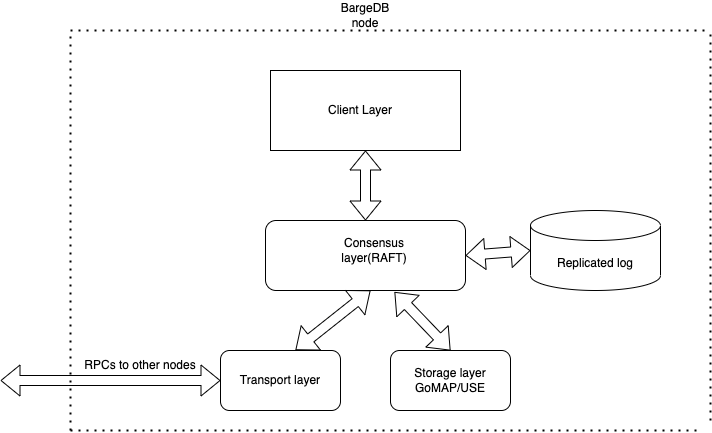

# BargeDB [In progress]

Consensus layer based on RAFT with pluggable storage and transport interface. Default storage is just go maps and default transport is gRPC. 
Reference: https://raft.github.io/raft.pdf

- BargeDB will support [USE ](https://github.com/utkarsh-pro/use) as one of the storage options
